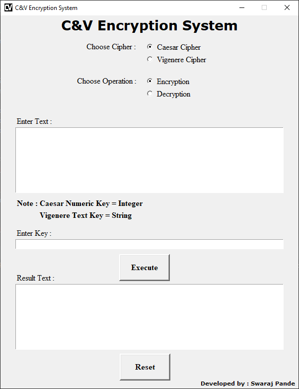

# Caesar and Vigenere Encryption System

This system encrypts and decrypts Caesar and Vigenere Ciphers using Python.

## To Build
Execute the following in a Terminal.
```bash
$ python3 main.py
```

## Layout


## Sources 
https://en.wikipedia.org/wiki/Caesar_cipher \
https://en.wikipedia.org/wiki/Vigenère_cipher

